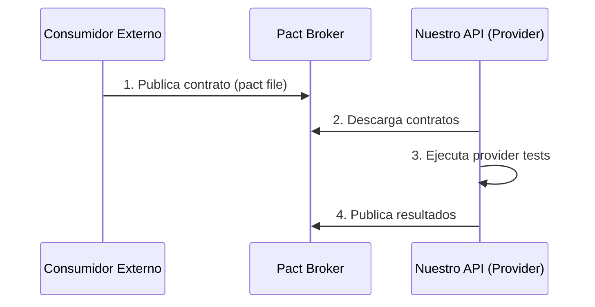
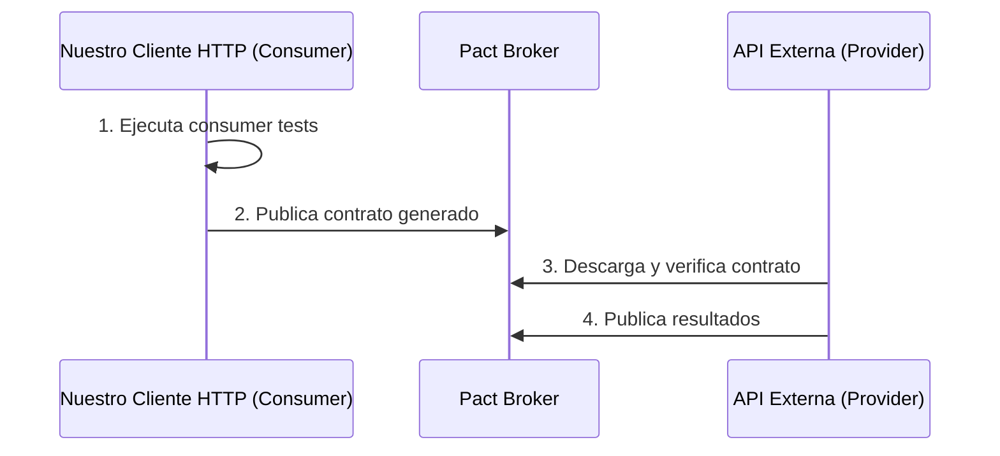

# Contract Testing with Pact en Arquitectura Hexagonal

Este directorio contiene tests de contrato usando [Pact](https://pact.io/), enfocados en validar los **Adaptadores de Infraestructura** según Arquitectura Hexagonal.

## Arquitectura Hexagonal y Contract Testing

En **Arquitectura Hexagonal (Puertos y Adaptadores)**, los tests de contrato validan específicamente los **adaptadores** que manejan comunicación externa, NO la lógica de negocio.

### Adaptadores en Este Proyecto

```
┌────────────────────────────────────────────────────────────┐
│              HEXAGONAL ARCHITECTURE                         │
├────────────────────────────────────────────────────────────┤
│                                                              │
│  INBOUND ADAPTERS (Entrada) ← Provider Tests               │
│  ├─ HTTP Controllers (Fastify)                             │
│  │  └─ infrastructure/http/v1/controllers/                 │
│  │  └─ infrastructure/http/v2/controllers/                 │
│  │                                                          │
│  APPLICATION CORE (Puertos + Dominio)                      │
│  ├─ Use Cases (application/)                               │
│  ├─ Domain (entities, value objects)                       │
│  └─ Repository Ports (interfaces)                          │
│  │                                                          │
│  OUTBOUND ADAPTERS (Salida) ← Consumer Tests*              │
│  ├─ InMemoryGreetingRepository (NO requiere Pact)          │
│  └─ [HTTP Clients externos] (NO implementado)              │
│                                                              │
└────────────────────────────────────────────────────────────┘

* Solo si tuviéramos adaptadores HTTP outbound
```

## Principios Clave

### ✅ QUÉ Probar con Pact

1. **Provider Tests**: Adaptadores HTTP **Inbound** (Controllers/Routes)
   - Validan que nuestros endpoints cumplen contratos
   - Prueban: `infrastructure/http/controllers`

2. **Consumer Tests**: Adaptadores HTTP **Outbound** (HTTP Clients)
   - Validan que nuestros clientes HTTP cumplen contratos
   - Prueban: `infrastructure/clients` o `infrastructure/adapters/http`

### ❌ QUÉ NO Probar con Pact

- ❌ Casos de uso (application layer)
- ❌ Entidades de dominio (domain layer)
- ❌ Repositorios in-memory
- ❌ Comunicación entre capas internas
- ❌ Lógica de negocio

## Archivos en Este Directorio

### 1. `greetings-provider.pact.spec.ts` ✅ ACTIVO

**Propósito**: Valida el **adaptador HTTP Inbound** (controllers que exponen nuestra API).

**Capa arquitectónica**: `infrastructure/http`

**Componentes probados**:
```
@contexts/greetings/infrastructure/http/
├── v1/controllers/GreetingController.ts  ← Probado
├── v2/controllers/GreetingController.ts  ← Probado
├── v1/routes/greeting.routes.ts
└── v2/routes/greeting.routes.ts
```

**Flujo de validación**:
1. Consumidores externos definen contratos (pact files)
2. Este test verifica que nuestros controllers cumplen esos contratos
3. Valida endpoints `/api/v1/greetings` y `/api/v2/greetings`

**Ejecutar**:
```bash
npm run test:contract
```

### 2. `greetings-consumer.pact.spec.ts` ⚠️ EJEMPLO EDUCATIVO

**Propósito**: Muestra cómo probar **adaptadores HTTP Outbound** si los tuviéramos.

**Estado**:
- ⚠️ Deshabilitado con `describe.skip`
- ℹ️ Solo para referencia educativa
- ❌ NO aplica al proyecto actual

**Razón**: Este proyecto NO tiene adaptadores que consuman APIs externas. Solo tenemos `InMemoryGreetingRepository` que no es un servicio HTTP externo.

**Uso futuro**: Si implementas un cliente HTTP para consumir APIs externas (ej: servicio de clima, autenticación OAuth externa), este ejemplo muestra cómo probarlo.

## Cuándo Usar Cada Tipo

### Provider Tests (Inbound Adapters)

**Usar cuando**:
- ✅ Exponemos endpoints HTTP (REST, GraphQL)
- ✅ Otros sistemas/equipos consumen nuestra API
- ✅ Necesitamos garantizar contratos con consumidores

**Ubicación arquitectónica**:
```
src/@contexts/{context}/infrastructure/http/
├── controllers/  ← Provider tests validan estos
└── routes/
```

**Ejemplo**:
```typescript
// src/@contexts/greetings/infrastructure/http/v1/controllers/GreetingController.ts
export class GreetingController {
  static async getGreeting(request, reply) {
    // Este adaptador HTTP inbound se valida con Provider tests
    const useCase = container.resolve("GetGreetingUseCase");
    const result = await useCase.execute();
    return reply.send(result);
  }
}
```

### Consumer Tests (Outbound Adapters)

**Usar cuando**:
- ✅ Consumimos APIs HTTP externas
- ✅ Implementamos clientes HTTP como adaptadores
- ✅ Necesitamos garantizar que cumplimos contratos de providers externos

**Ubicación arquitectónica** (si existiera):
```
src/@contexts/{context}/infrastructure/
├── clients/          ← Consumer tests validarían estos
│   └── WeatherApiClient.ts
└── adapters/
    └── ExternalAuthAdapter.ts
```

**Ejemplo conceptual**:
```typescript
// Si tuviéramos: src/@contexts/weather/infrastructure/clients/WeatherApiClient.ts
export class WeatherApiClient implements IWeatherService {
  constructor(private readonly httpClient: HttpClient) {}

  async getWeather(city: string): Promise<Weather> {
    // Este adaptador HTTP outbound se validaría con Consumer tests
    const response = await this.httpClient.get(`/weather/${city}`);
    return WeatherMapper.toDomain(response.data);
  }
}
```

## Flujo de Trabajo

### Para Provider Tests (Nuestro Caso Actual)



**Ejecución**:
```bash
# Local (sin Pact Broker)
npm run test:contract

# CI/CD (con Pact Broker)
export CI=true
export GIT_COMMIT=$(git rev-parse HEAD)
export GIT_BRANCH=$(git branch --show-current)
npm run test:contract
```

### Para Consumer Tests (Si Los Implementáramos)



## Ejemplo: Agregando un Adaptador Outbound HTTP

Si necesitas consumir una API externa, aquí está el proceso completo:

### 1. Definir el Puerto (Application Layer)

```typescript
// src/@contexts/weather/application/ports/outbound/IWeatherService.ts
export interface IWeatherService {
  getWeather(city: string): Promise<Weather>;
}
```

### 2. Implementar el Adaptador (Infrastructure Layer)

```typescript
// src/@contexts/weather/infrastructure/clients/WeatherApiClient.ts
import { IWeatherService } from "@contexts/weather/application/ports/outbound/IWeatherService";
import { Weather } from "@contexts/weather/domain/entities/Weather";

export class WeatherApiClient implements IWeatherService {
  constructor(
    private readonly baseUrl: string,
    private readonly httpClient: HttpClient
  ) {}

  async getWeather(city: string): Promise<Weather> {
    // Adaptador HTTP Outbound - consume API externa
    const response = await this.httpClient.get(
      `${this.baseUrl}/weather?city=${city}`
    );

    // Mapea de formato externo a entidad de dominio
    return WeatherMapper.toDomain(response.data);
  }
}
```

### 3. Crear Test de Contrato (Consumer Test)

```typescript
// test/contract/weather-consumer.pact.spec.ts
import { Pact } from "@pact-foundation/pact";
import { WeatherApiClient } from "@contexts/weather/infrastructure/clients/WeatherApiClient";

describe("Pact Consumer - WeatherApiClient Adapter", () => {
  const provider = new Pact({
    consumer: "GreetingsAPI",
    provider: "WeatherAPI",
    port: 5057,
    dir: path.resolve(process.cwd(), "pacts"),
  });

  beforeAll(async () => await provider.setup());
  afterAll(async () => await provider.finalize());

  it("should get weather data from external API", async () => {
    // Define el contrato esperado
    await provider.addInteraction({
      state: "weather data exists for Madrid",
      uponReceiving: "a request for Madrid weather",
      withRequest: {
        method: "GET",
        path: "/weather",
        query: { city: "Madrid" }
      },
      willRespondWith: {
        status: 200,
        headers: { "Content-Type": "application/json" },
        body: {
          temperature: 25,
          humidity: 60,
          condition: "sunny"
        }
      }
    });

    // Prueba el adaptador HTTP outbound
    const client = new WeatherApiClient(
      provider.mockService.baseUrl,
      httpClient
    );
    const weather = await client.getWeather("Madrid");

    expect(weather.temperature).toBe(25);
    expect(weather.condition).toBe("sunny");

    await provider.verify();
  });
});
```

## Provider States

Los states preparan el sistema para escenarios específicos:

```typescript
stateHandlers: {
  "default greeting exists": async () => {
    // Setup: Asegurar que existe el greeting por defecto
    // En este caso, nuestro InMemoryRepository siempre tiene datos
    return Promise.resolve();
  },
  "user is authenticated": async () => {
    // Setup: Crear usuario de prueba, generar token
    await createTestUser();
    return Promise.resolve();
  },
}
```

## Integración con CI/CD

### Ejemplo: GitHub Actions

```yaml
name: Contract Tests

jobs:
  provider-verification:
    runs-on: ubuntu-latest
    steps:
      - uses: actions/checkout@v3
      - uses: actions/setup-node@v3
      - run: npm install

      # Ejecutar provider tests
      - name: Verify Provider Contracts
        env:
          CI: true
          GIT_COMMIT: ${{ github.sha }}
          GIT_BRANCH: ${{ github.ref_name }}
        run: npm run test:contract

      # Publicar resultados (si usas Pact Broker)
      - name: Publish Verification Results
        if: success()
        env:
          PACT_BROKER_URL: ${{ secrets.PACT_BROKER_URL }}
          PACT_BROKER_TOKEN: ${{ secrets.PACT_BROKER_TOKEN }}
        run: |
          npx pact-broker publish-verification-results \
            --provider=GreetingsAPI \
            --provider-version=${{ github.sha }}
```

## Best Practices

### Para Arquitectura Hexagonal

1. **✅ DO**: Probar adaptadores de infraestructura
2. **✅ DO**: Mantener tests independientes de la lógica de negocio
3. **✅ DO**: Mapear entre formatos externos y entidades de dominio
4. **❌ DON'T**: Probar casos de uso con Pact
5. **❌ DON'T**: Probar entidades de dominio con Pact
6. **❌ DON'T**: Mezclar tests de contrato con tests unitarios

### Para Provider Tests

1. **Ser específico**: Define expectativas exactas, no schemas genéricos
2. **Implementar states**: Soporta todos los estados que los consumidores necesitan
3. **Ejecutar en CI**: Verifica en cada commit
4. **Versionar API**: Usa tags de versión en Pact Broker

### Para Consumer Tests

1. **Probar código real**: Prueba el adaptador completo, no solo fetch
2. **Usar provider states**: Prepara el provider para diferentes escenarios
3. **Mantenerlo simple**: Una interacción por test
4. **Mapear a dominio**: Convierte respuestas externas a entidades de dominio

## Limitaciones

Contract testing **NO reemplaza**:

- ❌ Tests E2E (flujos complejos multi-servicio)
- ❌ Tests de carga (características de performance)
- ❌ Tests de seguridad (autenticación, autorización)
- ❌ Tests unitarios (lógica de negocio)
- ❌ Tests de integración (bases de datos, colas de mensajes)

## Recursos

- [Pact Documentation](https://docs.pact.io/)
- [Hexagonal Architecture](https://alistair.cockburn.us/hexagonal-architecture/)
- [Pact JS](https://github.com/pact-foundation/pact-js)
- [Contract Testing Best Practices](https://docs.pact.io/getting_started/testing_contracts)
- [Ports and Adapters](https://herbertograca.com/2017/09/14/ports-adapters-architecture/)

## Resumen: Qué Probar en Cada Capa

| Capa | Qué Probar | Tipo de Test |
|------|-----------|--------------|
| **Domain** | Entidades, Value Objects, Reglas de negocio | Unit Tests |
| **Application** | Casos de uso, Orquestación | Unit/Integration Tests |
| **Infrastructure (HTTP Inbound)** | Controllers, Routes | **Provider Tests** (Pact) ✅ |
| **Infrastructure (HTTP Outbound)** | HTTP Clients, API Adapters | **Consumer Tests** (Pact) ⚠️ |
| **Infrastructure (Persistence)** | Repositories, Databases | Integration Tests |

---

**Estado Actual del Proyecto**:
- ✅ Provider Tests: Implementados y activos
- ⚠️ Consumer Tests: Solo ejemplo educativo (no tenemos adaptadores HTTP outbound)

**Versión**: 2.0
**Última Actualización**: Diciembre 2024
